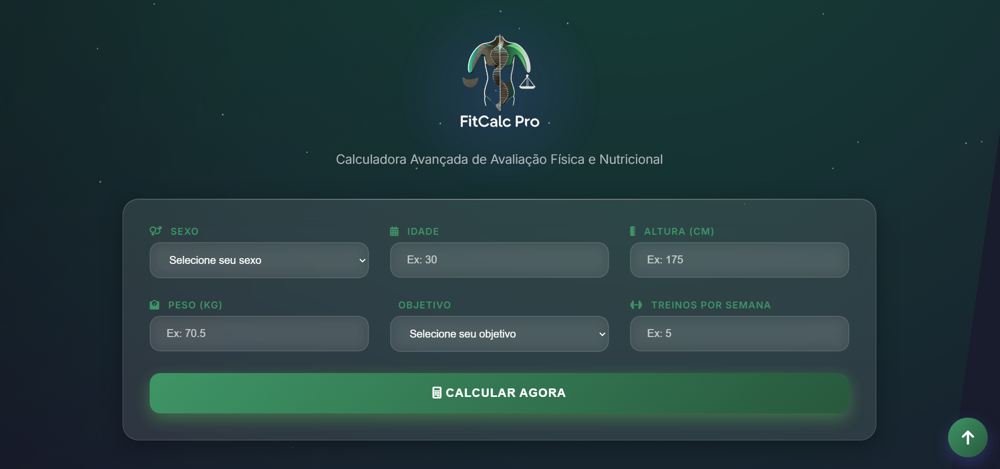

<h1 align="center">Projeto: Calculadora Avançada de IMC e Avaliação Físico-Nutricional</h1>

<p align="center">
Programa exclusivo e gratuito.
</p>

<p align="center">
  <a href="#-tecnologias">Tecnologias</a>&nbsp;&nbsp;&nbsp;|&nbsp;&nbsp;&nbsp;
  <a href="#-projeto">Projeto</a>&nbsp;&nbsp;&nbsp;|&nbsp;&nbsp;&nbsp;
  <a href="#-layout">Layout</a>&nbsp;&nbsp;&nbsp;|&nbsp;&nbsp;&nbsp;
  <a href="#memo-licença">Licença</a>
</p>

<p align="center">
  
</p>

<br>

<p align="center">
  
</p>

# Projeto: Calculadora Avançada de IMC e Avaliação Físico-Nutricional

Bem-vindo a **Calculadora Avançada de IMC e Avaliação Físico-Nutricional**,
Este projeto é uma calculadora avançada de IMC integrada a uma avaliação física e nutricional completa.
Ideal para nutricionistas, personal trainers, clínicas e apps de saúde.

## 🖥️ Demonstração

Você pode visualizar o site de exemplo no seguinte link:

👉 [Visualizar Site Exemplo](https://fitcalc-pro.netlify.app/)

## 🚀 Funcionalidades

- ✅ Classificação do IMC com alerta de risco

- ✅ Análise por sexo, idade, altura, peso e nível de atividade

- ✅ Cálculo de TMB (Taxa Metabólica Basal) e Gasto Energético Diário (GET)

- ✅ Recomendações de ingestão calórica e macronutrientes (carboidratos, proteínas, gorduras)

- ✅ Sugestões personalizadas com base no objetivo: emagrecimento, manutenção ou hipertrofia

- ✅ Exportação de plano alimentar individualizado

- ✅ Compatível com front-ends, apps e sistemas de gestão de saúde


## 📋 Como Utilizar

1. **Clone o Repositório**

   ```bash
   git clone https://github.com/FranciscoMarquesdev/projetonissan.git
   ```

2. **Abra no seu editor de código favorito (VS Code, Sublime, etc.).**

3. **Edite o conteúdo**

   - Substitua as imagens, textos e informações pessoais nas respectivas seções do código.

4. **Hospede seu landing page**
   - O site é estático, então pode ser hospedado facilmente em plataformas como Netlify, Vercel ou GitHub Pages.

## 🔧 Tecnologias Utilizadas


## 📦 Instalação

Não é necessário instalar nada além de um editor de texto e um navegador para testar. Você pode modificar o conteúdo diretamente nos arquivos HTML e CSS.

## 👨‍🏫 Sobre Mim

Eu sou **Francisco Marques**, estudante de Análise e Desenvolvimento de Sistemas, atualmente no segundo semestre, e estou apaixonado por tecnologia e desenvolvimento web. Desde que comecei minha jornada, adquiri experiência sólida em HTML, CSS e JavaScript, ferramentas fundamentais para a criação de sites interativos e responsivos.

## 🎁 Como Contribuir

Se você tem sugestões de melhorias ou encontrou algum bug, fique à vontade para contribuir com o projeto. Basta abrir uma issue ou fazer um pull request.
